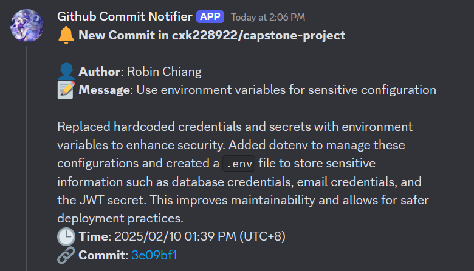

# Discord_GitHub-Commit-Notifier

This is a simple Python script that notifies you when a commit is made to a GitHub repository.

## How to use

1. Clone the repository
2. Install the packages
    ```bash
    pip install discord_webhook requests
    ```
3. Configure the script:
    - Replace `<username>/<repo>` with your GitHub repository information.
    - Replace `<discord_webhook_url>` with your Discord webhook URL. [(more info)](https://support.discord.com/hc/en-us/articles/228383668-Intro-to-Webhooks)
    - Replace `<github_repo_token>` with your GitHub repository token (if the repository is private). [(more info)](https://docs.github.com/en/github/authenticating-to-github/creating-a-personal-access-token)

4. Run the script:
    ```bash
    python3 webhook.py
    ```

## Files

- `webhook.py`: The main script that checks for new commits and sends notifications to Discord.
- `README.md`: This file.

## Requirements

- Python 3.x
- `discord_webhook` package
- `requests` package

## License

This project is licensed under the MIT License.

